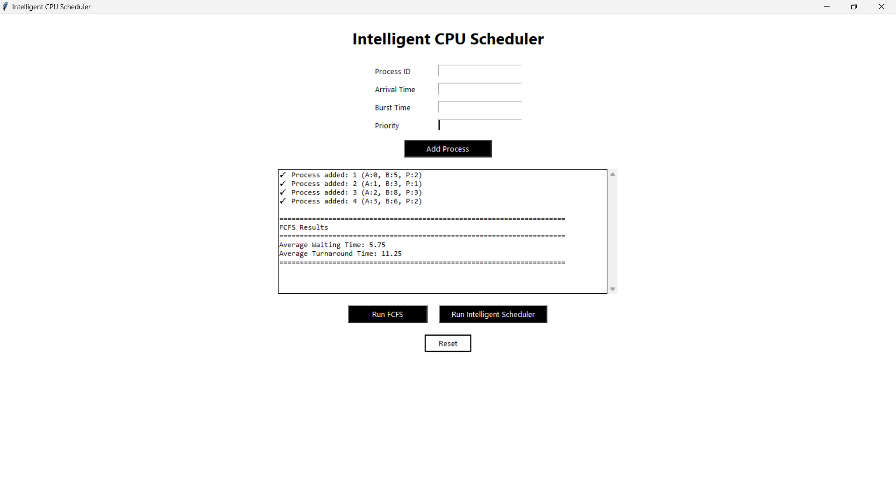
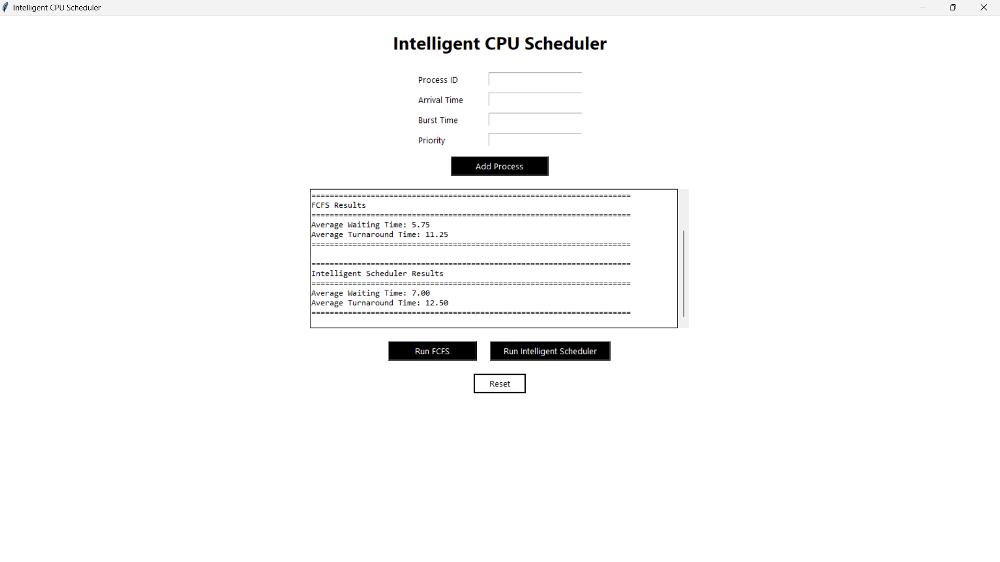

# Intelligent-CPU-Scheduler

## Project Overview

The Intelligent CPU Scheduler is a simulation based desktop application that demonstrates how CPU scheduling decisions can be improved using intelligent logic instead of relying only on traditional algorithms.

This project compares the First Come First Serve scheduling algorithm with an Intelligent Scheduler that considers priority, burst time, and waiting time to decide execution order.

The application provides a clean graphical user interface for process input, scheduling execution, performance evaluation, and visualization.

---

## Objectives

The main objectives of this project are

• To understand CPU scheduling concepts
• To implement traditional and intelligent scheduling algorithms
• To compare scheduling performance using metrics
• To visualize scheduling using Gantt charts
• To build a clean and user friendly GUI

---

## Features

• Add multiple processes with arrival time, burst time, and priority
• Execute First Come First Serve scheduling
• Execute Intelligent CPU Scheduling algorithm
• Calculate average waiting time and turnaround time
• Visualize execution using Gantt charts
• Clean minimal white background graphical interface
• Error handling and input validation

---

## Project Structure

```
Intelligent-CPU-Scheduler/
│
├── main.py
├── gui.py
├── process.py
├── schedulers.py
├── visualization.py
└── README.md
```

---

## Module Description

### Process Module

Handles process creation and stores all attributes such as arrival time, burst time, priority, waiting time, and turnaround time.

### Scheduling Module

Contains the implementation of
• First Come First Serve Scheduler
• Intelligent CPU Scheduler
• Performance metric calculations

### Visualization Module

Responsible for generating Gantt charts to visually represent CPU scheduling execution.

### GUI Module

Provides a clean and interactive user interface for users to input processes, run scheduling algorithms, and view results.

---

## Intelligent Scheduling Logic

The Intelligent Scheduler calculates a score for each ready process using the formula

Score = (2 × Priority) + (3 ÷ Burst Time) + Waiting Time

The process with the highest score is selected for CPU execution.

---

## Technologies Used

### Programming Language

Python

### Libraries and Tools

Tkinter
Matplotlib

### Version Control

Git
GitHub

---

## How to Run the Project

1. Ensure Python is installed on your system
2. Clone the repository from GitHub
3. Navigate to the project directory
4. Run the following command

```
python main.py
```

---

## GitHub Workflow

The project was developed using GitHub version control with multiple commits to track progress.

• Initial project setup
• FCFS scheduler implementation
• Intelligent scheduler logic added
• GUI development
• Visualization enhancements
• Input validation and UI polish
• Final stable version

---

## Results

The Intelligent Scheduler demonstrates improved performance in terms of average waiting time when compared to the traditional FCFS algorithm for most test cases.


The Gantt chart visualization helps in clearly understanding CPU execution order.


---

## Future Enhancements

• Add Round Robin scheduling algorithm
• Add machine learning based scheduling
• Export results to file
• Add dark mode interface
• Convert application to web based interface

---

## Conclusion

This project successfully demonstrates how intelligent decision making can enhance CPU scheduling efficiency. The modular design, clean UI, and visualization make it a strong educational tool for understanding operating system concepts.

---

## Author

Project developed as part of academic coursework.
